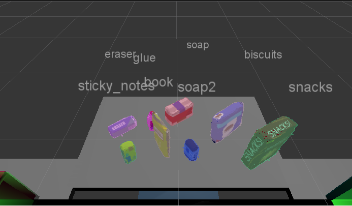
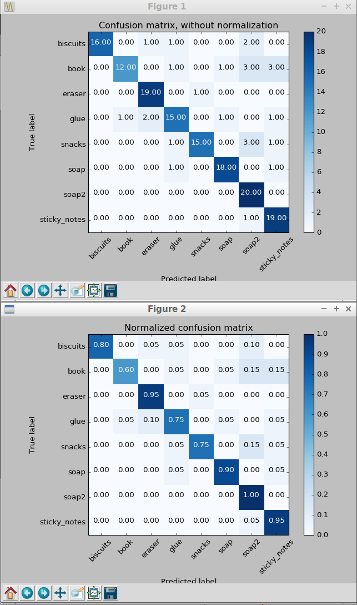
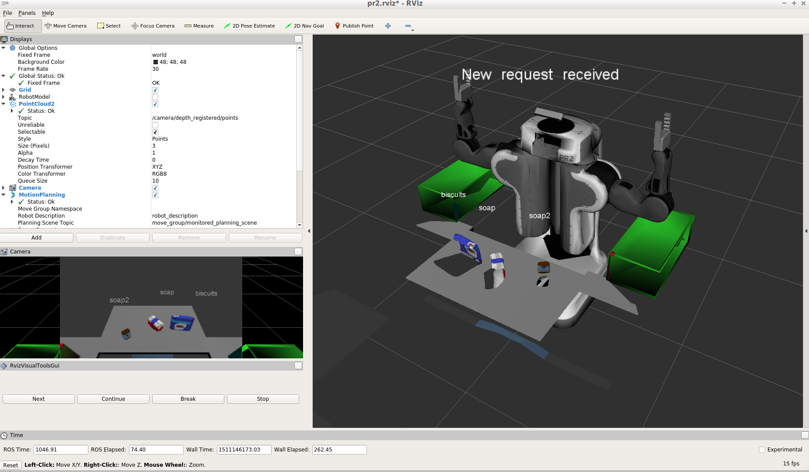
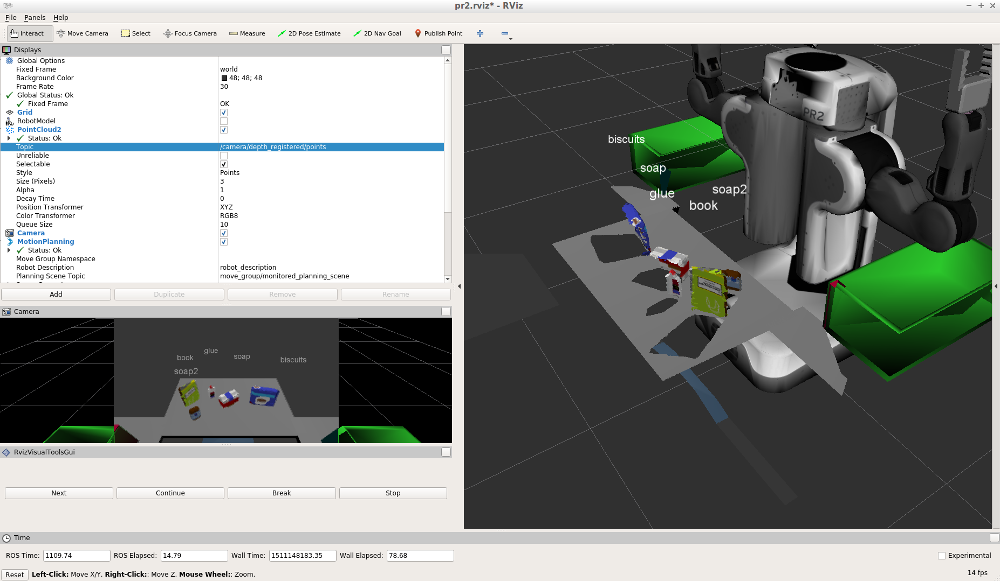
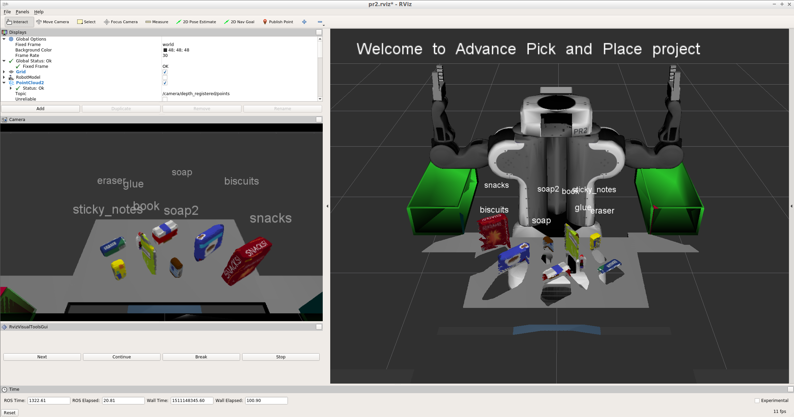

## Project: Perception Pick & Place
### Writeup / README
#### 1. Provide a Writeup / README that includes all the rubric points and how you addressed each one.  You can submit your writeup as markdown or pdf.  
You're reading it!

### Exercise 1, 2 and 3 pipeline implemented
#### 1. Complete Exercise 1 steps. Pipeline for filtering and RANSAC plane fitting implemented.
My implementation starts by downsampling the point cloud with a voxel filter of leaf size 0.005. Next, I filter along the z axis (remove everything below and far above the table) and along the y axis (remove everything to the far left and right of the table). I then remove noise in the point cloud by using a statistical outlier filter. Finally, I use RANSAC plane fitting to select the points that are on the table and the points that are not, which represent the objects.

#### 2. Complete Exercise 2 steps: Pipeline including clustering for segmentation implemented.  
For clustering, I use Euclidian clustering with a tolerance of 0.03, min cluster size of 10, and max cluster size of 5000. I use the clustering algorithm to process my already filtered data, resulting in a group of points representing each object. In the picture below you can see that my implementation successfully separates each object in a complex scene.

#### 2. Complete Exercise 3 Steps.  Features extracted and SVM trained.  Object recognition implemented.
To train my object classifier, I collect data on each object in 40 randomized poses. For each object, I collect features from both HSV color and surface normals, with each individual value split up into a histogram with 32 bins (HSV values range from 0 to 256 and surface normal values range from -1 to 1). For training the classifier, I started with the default support vector machine, but found that using a `ExtraTreesClassifier` results in a much more accurate classifier with fewer samples needed.

With this classifier, I am able to classify all objects correctly in all three scenes!

### Pick and Place Setup
#### 1. For all three tabletop setups (`test*.world`), perform object recognition, then read in respective pick list (`pick_list_*.yaml`). Next construct the messages that would comprise a valid `PickPlace` request output them to `.yaml` format.
In the `pr2_mover` method, I implemented the logic for picking up each object in the pick list one by one. For each object specified, I find the object within the precalculated list of detected objects and use the information about that object to send a `PickPlace` request with the centroid of the object as the target pickup location. I also send a dropoff location calculated based on the specified dropbox for the object and the `dropbox.yaml` file. After sending the request, I store a dictionary of the requests values in an array, which is written to a `output_*.yaml` file after all objects have been picked and placed.

The implementation of this project was relatively straightforward, as I mostly followed the examples in the lectures and written materials. I used Visual Studio Code for writing the Python code in this project, since it is relatively lightweight but supports IDE features such as code completion for Python.

In the future, I would like to look for better ways to collect the training data, which was the slowest part of this project since each object/orientation had to be analyzed one-by-one instead of collecting data in parallel (this was further slowed down since I needed to run the simulator inside a virtual machine instead of directly on my computer).
